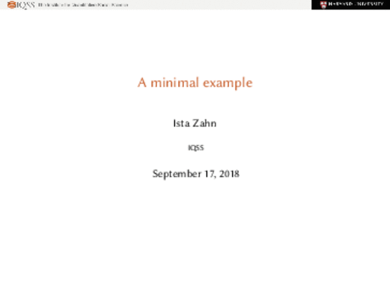

## binb [](https://travis-ci.org/eddelbuettel/binb) [](http://www.gnu.org/licenses/gpl-2.0.html) [](https://cran.r-project.org/package=binb) [](http://www.r-pkg.org/pkg/binb)

Binb is not Beamer: Stylish pdf Presentation from RMarkdown

### Motivation

The [Beamer](https://github.com/josephwright/beamer) package is very popular for making pdf
presentation from LaTeX, and also supported from Markdown and
[RMarkdown](https://github.com/rstudio/rmarkdown). This package provides two custom (LaTeX) themes
for [Beamer](https://github.com/josephwright/beamer) adapted for RMarkdown use:
- [Metropolis](https://github.com/matze/mtheme) (formerly `mtheme`) by Matthias Vogelgesang
- [IQSS](https://github.com/IQSS/iqss-beamer-theme) by Ista Zahn

The original LaTeX styles been converted to be directly useable from [RMarkdown](https://github.com/rstudio/rmarkdown)

### Example

#### Metropolis

Consider the following minimal example, adapted from the original minimal example at the bottom of
the [Metropolis](https://github.com/matze/mtheme) page:

````{md}
---
title: A minimal example
author: Matthias Vogelgesang
date: \today
institute: Centre for Modern Beamer Themes
output: binb::metropolis
---

# First Section

## First Frame

Hello, world!
````

It creates a [three-page pdf file](figures/metropolis_minimal.pdf) which we converted into this 
animated gif (which loses font crispness, sadly):


#### IQSS

Similarly, for IQSS we use the following input adapting the example above but showing sections and
subsections for the nice headings it generates:

````{md}
---
title: A minimal example
author: Ista Zahn
date: \today
institute: IQSS
output: binb::iqss
---

# First Section

## First Sub-Section

### First Frame

Hello, world!

# Second Section

## Second Subsection

### Second Frame

Another planet!

````

This creates this [pdf file](figures/iqss_minimal.pdf) which we converted into this 
animated gif (also losing font crispness):



        
### Status

The package is (currently) fairly new and not yet on [CRAN](https://cran.r-project.org/). 

### Usage 

As the package is not yet CRAN, you must install from GitHub _e.g._ via

```r
install.packages("remotes")  # if needed
remotes::install_github("eddelbuettel/binb")
```

to install it from CRAN, and then use as a Markdown template via RStudio, or use code such as

```r
library(rmarkdown)
draft("myslides.Rmd", template="metropolis", package="binb", edit=FALSE)
setwd("myslides")  ## template creates a new subdir
render("myslides.Rmd")
```

to create a first draft of a new `myslides.Rmd`.        

Once installed, the above code examples should work as expected.

### Requirements

Beyond the R package dependencies, a working `pandoc` binary is needed. RStudio installs
its own copy, otherwise do what is needed on your OS (_i.e._, something like `sudo apt-get
install pandoc pandoc-citeproc`).

The [Metropolis](https://github.com/matze/mtheme) LaTeX package is used, but we assume that is is
installed via TeXLive, MikTeX or another LaTeX bundle. The LaTeX code for the [IQSS Beamer
Theme](https://github.com/IQSS/iqss-beamer-theme) is included (adapted for
[RMarkdown](https://github.com/rstudio/rmarkdown) use).

These themse use additional fonts you may need to install:

- [Metropolis](https://github.com/matze/mtheme) wants [Fira Sans](https://github.com/mozilla/Fira)
  but can proceed with alternate fonts;
- [IQSS Beamer Theme](https://github.com/IQSS/iqss-beamer-theme) really requires
  [Libertinus](https://github.com/libertinus-fonts/libertinus), see the
  [IQSS Beamer Theme](https://github.com/IQSS/iqss-beamer-theme)  page for details.
  
If you use [Debian](https://www.debian.org) or [Ubuntu](https://www.ubuntu.com), you can use the
informal font packages I created for [Fira and Fira Sans](https://github.com/eddelbuettel/pkg-fonts-fira)
and [Libertinus](https://github.com/eddelbuettel/pkg-fonts-libertinus), respectively.

### Authors

Dirk Eddelbuettel wrote this package. Ista Zahn authored the included IQSS Beamer Theme.

### License

GPL-2 for this package.
